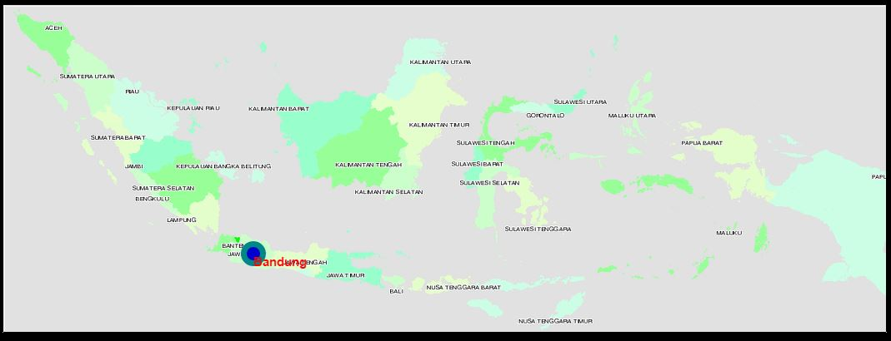

**Latar Belakang**

Pada materi kali ini akan sedikit membahas tentang pengertian OpenLayers, apa yang dimaksud dengan markers dan bagaimana cara untuk menampilkan markers?

**Pembahasan**

OpenLayers adalah library Javascript murni untuk menampilkan data peta di berbagai web browser, tanpa server side dependencies. Open Layer adalah bersifat Free Software, yang dibangun oleh komunitas Open Source.

Markers base layer sangat mudah dipergunakan dan memungkinkan penggunaan fungsi addMarkers untuk menambah marker pada layer. Hanya mendukung point/ titik.

Cara untuk menampilkan marker dengan openlayer yaitu buka website ini [http://openlayers.org/en/latest/examples/overlay.html](http://openlayers.org/en/latest/examples/overlay.html) kemudian copy kan seluruh kodenya dan simpan dengan format html. Source code nya seperti dibawah ini:

<!DOCTYPE html>
<html>
  <head>
    <title>Overlay</title>
    <link rel="stylesheet" href="https://openlayers.org/en/v3.20.1/css/ol.css" type="text/css">
    <!-- The line below is only needed for old environments like Internet Explorer and Android 4.x -->
    
    
    
    <link rel="stylesheet" href="https://maxcdn.bootstrapcdn.com/bootstrap/3.3.6/css/bootstrap.min.css">
    
    
  </head>
  <body>
    

    

      <!-- Clickable label for Vienna -->
      <a class="overlay" id="bandung" target="_blank" href="https://id.wikipedia.org/wiki/Kota_Bandung">Bandung</a>
      

      <!-- Popup -->
      

    

    
  </body>
</html>

Output dari source code diatas yaitu :

**Kesimpulan**

Perlu dilakukan praktek secara langsung agar mengetahui lebih detail tentang OpenLayers, Markers dan Cara membuatnya.